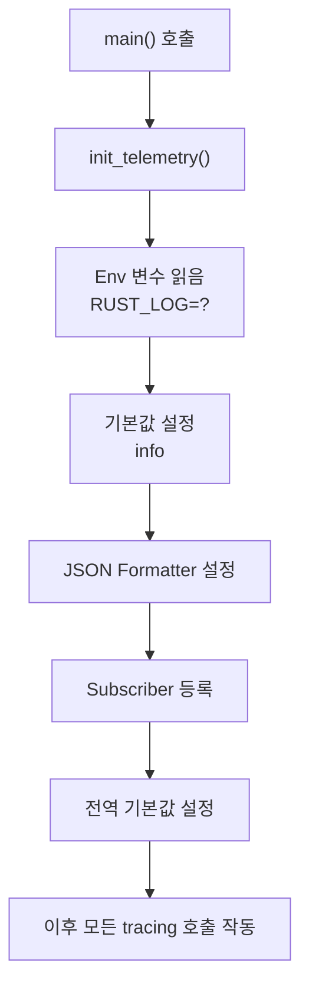

# 구조화된 로깅 구현 가이드

## 개요

이 문서는 zero2prod 프로젝트에 구조화된 로깅이 어떻게 구현되었는지에 대한 기술 세부사항을 설명합니다.

## 목차
1. [파일 구조](#파일-구조)
2. [핵심 구현 파일](#핵심-구현-파일)
3. [초기화 흐름](#초기화-흐름)
4. [각 모듈별 로깅 구현](#각-모듈별-로깅-구현)
5. [통합 테스트](#통합-테스트)

---

## 파일 구조

```
zero2prod/
├── src/
│   ├── telemetry.rs              # ⭐ 구조화된 로깅 초기화
│   ├── logger.rs                 # HTTP 요청/응답 로깅 미들웨어
│   ├── main.rs                   # 애플리케이션 시작점 로깅
│   ├── lib.rs                    # 모듈 정의
│   ├── configuration.rs          # 설정 로깅
│   ├── startup.rs                # 서버 시작 로깅
│   └── routes/
│       ├── mod.rs
│       ├── health_check.rs        # 헬스 체크 엔드포인트 로깅
│       └── subscriptions.rs       # 구독 기능 로깅
├── Cargo.toml                     # 의존성 설정
└── docs/
    ├── STRUCTURED_LOGGING.md      # 사용 가이드 (현재 문서)
    └── LOGGING_IMPLEMENTATION.md  # 구현 세부사항
```

---

## 핵심 구현 파일

### 1. src/telemetry.rs - 로깅 시스템 초기화

```rust
use tracing_subscriber::{layer::SubscriberExt, util::SubscriberInitExt};

/// 구조화된 로깅을 초기화합니다.
/// JSON 형식의 로그를 출력하며, RUST_LOG 환경 변수로 로그 레벨을 제어합니다.
pub fn init_telemetry() {
    let env_filter = tracing_subscriber::EnvFilter::try_from_default_env()
        .unwrap_or_else(|_| tracing_subscriber::EnvFilter::new("info"));

    let formatting_layer = tracing_subscriber::fmt::layer()
        .with_writer(std::io::stdout)
        .json();

    tracing_subscriber::registry()
        .with(env_filter)
        .with(formatting_layer)
        .init();
}
```

**핵심 개념:**

| 개념 | 설명 |
|------|------|
| `EnvFilter` | `RUST_LOG` 환경변수에서 로그 레벨 읽음, 기본값 "info" |
| `fmt::layer()` | 로그 포매팅 계층 설정 |
| `.json()` | JSON 형식으로 출력하도록 지정 |
| `registry()` | 모든 계층을 등록하는 중앙 허브 |
| `.init()` | 전역 기본 subscriber 설정 |

### 2. src/logger.rs - HTTP 미들웨어 로깅

**변경 전:**
```rust
use log::info;

// 문자열 기반 로깅 - 검색이 어려움
info!("Request started: {} {}", method, path);
info!("Request completed: {} {} - Status: {} ({}ms)",
      method, path, status.as_u16(), elapsed.as_millis());
```

**변경 후:**
```rust
// 구조화된 필드를 포함한 로깅 - 검색/분석이 용이함
tracing::info!(
    method = %method,
    path = %path,
    query = %query,
    "HTTP request received"
);

tracing::info!(
    method = %method,
    path = %path,
    status = status_code,
    elapsed_ms = elapsed_ms,
    "HTTP request completed"
);
```

**미들웨어 작동 흐름:**

```
요청 도착
    ↓
트레이싱 시작 (HTTP request received 로그)
    ↓
이전 미들웨어 체인 실행
    ↓
응답 생성
    ↓
트레이싱 종료 (HTTP request completed 로그)
    ↓
응답 반환
```

### 3. src/main.rs - 애플리케이션 시작 로깅

```rust
#[tokio::main]
async fn main() -> std::io::Result<()> {
    // 1단계: 텔레메트리 초기화 (반드시 먼저)
    init_telemetry();
    tracing::info!("Starting application");

    // 2단계: 설정 로드
    let configuration = match get_configuration() {
        Ok(config) => {
            tracing::info!("Configuration loaded successfully");
            config
        }
        Err(e) => {
            tracing::error!("Failed to read configuration: {}", e);
            return Err(std::io::Error::new(
                std::io::ErrorKind::InvalidInput,
                "Configuration error"
            ));
        }
    };

    // 3단계: 데이터베이스 연결
    tracing::info!("Attempting to connect to database");

    let pool = PgPoolOptions::new()
        .max_connections(5)
        .connect(&connection_string)
        .await
        .map_err(|e| {
            tracing::error!("Failed to create connection pool: {}", e);
            std::io::Error::new(
                std::io::ErrorKind::ConnectionRefused,
                "Database connection error"
            )
        })?;

    tracing::info!("Database connection pool created successfully");

    // 4단계: 서버 시작
    tracing::info!("Binding server to address: {}", address);
    let listener = TcpListener::bind(&address)?;
    tracing::info!("Server listening on: {}", address);

    let server = run(listener, pool)?;
    tracing::info!("Server started successfully");

    let _ = server.await;
    Ok(())
}
```

**로그 흐름:**

```
[INFO] Starting application
[INFO] Configuration loaded successfully
[INFO] Attempting to connect to database
[INFO] Database connection pool created successfully
[INFO] Binding server to address: 127.0.0.1:8000
[INFO] Server listening on: 127.0.0.1:8000
[INFO] Server started successfully
```

### 4. src/routes/subscriptions.rs - 비즈니스 로직 로깅

```rust
pub async fn subscribe(
    form: web::Form<FormData>,
    pool: web::Data<PgPool>,
) -> HttpResponse {
    // ... 유효성 검증 ...

    if !name_valid || !email_valid {
        tracing::warn!(
            name_valid = name_valid,
            email_valid = email_valid,
            "Invalid subscription request received"
        );
        return HttpResponse::BadRequest().finish();
    }

    let name = form.name.as_ref().unwrap().trim();
    let email = form.email.as_ref().unwrap().trim();
    let subscriber_id = Uuid::new_v4();

    // 비즈니스 작업 시작
    tracing::info!(
        email = %email,
        name = %name,
        "Processing new subscription"
    );

    match sqlx::query(
        "INSERT INTO subscriptions (id, email, name, subscribed_at) VALUES ($1, $2, $3, $4)"
    )
    .bind(subscriber_id)
    .bind(email)
    .bind(name)
    .bind(Utc::now())
    .execute(pool.get_ref())
    .await
    {
        Ok(_) => {
            tracing::info!(
                subscriber_id = %subscriber_id,
                email = %email,
                "New subscriber saved successfully"
            );
            HttpResponse::Ok().finish()
        }
        Err(e) => {
            tracing::error!(
                subscriber_id = %subscriber_id,
                email = %email,
                error = %e,
                "Failed to save subscriber to database"
            );
            HttpResponse::InternalServerError().finish()
        }
    }
}
```

**로그 이벤트 시퀀스:**

```
요청 분석
    ↓
[WARN] Invalid subscription request received (유효성 검증 실패)
    또는
[INFO] Processing new subscription (유효성 검증 성공)
    ↓
데이터베이스 작업
    ↓
[INFO] New subscriber saved successfully (성공)
    또는
[ERROR] Failed to save subscriber to database (실패)
```

### 5. src/routes/health_check.rs - 헬스 체크 로깅

```rust
pub async fn health_check() -> HttpResponse {
    tracing::debug!("Health check endpoint called");
    HttpResponse::Ok().finish()
}
```

**특징:**
- DEBUG 레벨 사용: 애플리케이션 모니터링에는 필요하지 않으므로 낮은 레벨
- 기본 설정(info)에서는 출력되지 않음
- `RUST_LOG=debug` 설정 시에만 출력

---

## 초기화 흐름

### 애플리케이션 시작 순서



### 텔레메트리 초기화 타이밍

```rust
#[tokio::main]
async fn main() {
    // ✅ 반드시 먼저: 로깅 초기화
    init_telemetry();

    // 이 시점 이후부터는 모든 tracing 호출이 작동
    tracing::info!("This will be logged");

    // 설정 로드
    let config = get_configuration();

    // ... 나머지 코드 ...
}
```

### 로그 레벨 필터링 흐름

```
트레이싱 이벤트 발생
    ↓
EnvFilter (RUST_LOG 체크)
    ↓
┌─────────────────────────┐
│ 로그 레벨 비교            │
└─────────────────────────┘
    ↓
   / \
  /   \
 /     \
레벨 통과? → 예 → Formatter → JSON 출력
 \           ↓
  \        아니오
   \         ↓
    \    필터링됨 (버려짐)
     \
      버려짐
```

---

## 각 모듈별 로깅 구현

### 초기화 및 시작 로깅 (main.rs)

```
목적: 애플리케이션 생명주기 추적
레벨: INFO
필드: 없음 (기본 메시지만)

예시:
[INFO] Starting application
[INFO] Configuration loaded successfully
[INFO] Database connection pool created successfully
[INFO] Server started successfully
```

### HTTP 트래픽 로깅 (logger.rs)

```
목적: HTTP 요청/응답 추적
레벨: INFO
필드: method, path, query, status, elapsed_ms

예시:
[INFO] HTTP request received
       method=POST, path=/subscriptions, query=

[INFO] HTTP request completed
       method=POST, path=/subscriptions, status=200, elapsed_ms=45
```

### 비즈니스 로직 로깅 (subscriptions.rs)

```
목적: 데이터 처리 추적
레벨: INFO (성공), WARN (검증 실패), ERROR (DB 오류)
필드: email, name, subscriber_id, error

예시:
[INFO] Processing new subscription
       email=user@example.com, name=John Doe

[INFO] New subscriber saved successfully
       subscriber_id=550e8400-e29b-41d4-a716-446655440000,
       email=user@example.com

[ERROR] Failed to save subscriber to database
        subscriber_id=550e8400-e29b-41d4-a716-446655440000,
        email=user@example.com, error=duplicate key value violates unique constraint
```

### 헬스 체크 로깅 (health_check.rs)

```
목적: 엔드포인트 활성 상태 추적
레벨: DEBUG (기본 설정에서 출력 안 됨)
필드: 없음

예시 (RUST_LOG=debug일 때만):
[DEBUG] Health check endpoint called
```

---

## 통합 테스트

### 테스트 설정 (tests/health_check.rs)

구조화된 로깅이 추가되어도 테스트는 정상 작동합니다:

```rust
#[tokio::test]
async fn health_check_works() {
    let app = spawn_app().await;
    let client = reqwest::Client::new();

    let response = client
        .get(&format!("{}/health_check", &app.address))
        .send()
        .await
        .expect("Failed to execute request.");

    assert!(response.status().is_success());
    assert_eq!(Some(0), response.content_length());
}
```

**테스트 시 로그 출력:**
- 로그는 stderr로 출력됨
- 테스트 성공 여부에 영향을 주지 않음
- `cargo test -- --nocapture`로 테스트 중 로그 확인 가능

### 테스트 실행 방법

```bash
# 일반 테스트 (로그 보이지 않음)
cargo test

# 테스트 중 로그 확인
RUST_LOG=info cargo test -- --nocapture

# 특정 테스트만 실행
RUST_LOG=debug cargo test subscribe_returns_a_200 -- --nocapture
```

---

## 로그 출력 예제

### 애플리케이션 시작 시

```json
{"timestamp":"2025-11-14T10:00:00.000Z","level":"INFO","message":"Starting application","target":"zero2prod","module_path":"zero2prod::main","file":"src/main.rs","line":12}
{"timestamp":"2025-11-14T10:00:00.001Z","level":"INFO","message":"Configuration loaded successfully","target":"zero2prod","module_path":"zero2prod::main","file":"src/main.rs","line":18}
{"timestamp":"2025-11-14T10:00:00.002Z","level":"INFO","message":"Attempting to connect to database","target":"zero2prod","module_path":"zero2prod::main","file":"src/main.rs","line":30}
{"timestamp":"2025-11-14T10:00:00.152Z","level":"INFO","message":"Database connection pool created successfully","target":"zero2prod","module_path":"zero2prod::main","file":"src/main.rs","line":46}
{"timestamp":"2025-11-14T10:00:00.153Z","level":"INFO","message":"Binding server to address: 127.0.0.1:8000","target":"zero2prod","module_path":"zero2prod::main","file":"src/main.rs","line":50}
{"timestamp":"2025-11-14T10:00:00.153Z","level":"INFO","message":"Server listening on: 127.0.0.1:8000","target":"zero2prod","module_path":"zero2prod::main","file":"src/main.rs","line":53}
{"timestamp":"2025-11-14T10:00:00.154Z","level":"INFO","message":"Server started successfully","target":"zero2prod","module_path":"zero2prod::main","file":"src/main.rs","line":57}
```

### 구독 요청 처리 시

```json
{"timestamp":"2025-11-14T10:00:05.234Z","level":"INFO","message":"HTTP request received","target":"zero2prod","module_path":"zero2prod::logger","method":"POST","path":"/subscriptions","query":""}
{"timestamp":"2025-11-14T10:00:05.235Z","level":"INFO","message":"Processing new subscription","target":"zero2prod","module_path":"zero2prod::routes::subscriptions","email":"john@example.com","name":"John Doe"}
{"timestamp":"2025-11-14T10:00:05.267Z","level":"INFO","message":"New subscriber saved successfully","target":"zero2prod","module_path":"zero2prod::routes::subscriptions","subscriber_id":"550e8400-e29b-41d4-a716-446655440000","email":"john@example.com"}
{"timestamp":"2025-11-14T10:00:05.268Z","level":"INFO","message":"HTTP request completed","target":"zero2prod","module_path":"zero2prod::logger","method":"POST","path":"/subscriptions","status":200,"elapsed_ms":34}
```

### 오류 처리 시

```json
{"timestamp":"2025-11-14T10:00:10.345Z","level":"WARN","message":"Invalid subscription request received","target":"zero2prod","module_path":"zero2prod::routes::subscriptions","name_valid":false,"email_valid":false}
{"timestamp":"2025-11-14T10:00:11.456Z","level":"ERROR","message":"Failed to save subscriber to database","target":"zero2prod","module_path":"zero2prod::routes::subscriptions","subscriber_id":"550e8400-e29b-41d4-a716-446655440000","email":"duplicate@example.com","error":"duplicate key value violates unique constraint \"subscriptions_email_key\""}
```

---

## 성능 고려사항

### 로깅 오버헤드

| 로그 레벨 | 메모리 | CPU | I/O |
|----------|-------|-----|-----|
| TRACE | 높음 | 높음 | 높음 |
| DEBUG | 중간 | 중간 | 중간 |
| INFO (기본) | 낮음 | 낮음 | 낮음 |
| WARN | 매우 낮음 | 매우 낮음 | 매우 낮음 |
| ERROR | 매우 낮음 | 매우 낮음 | 매우 낮음 |

### 최적화 팁

```bash
# 프로덕션 환경: WARN 이상만 로그
RUST_LOG=warn cargo run --release

# 개발 환경: 특정 모듈만 DEBUG
RUST_LOG=zero2prod=debug,info cargo run

# 성능 테스트: ERROR만 로그
RUST_LOG=error cargo run --release
```

---

## 향후 개선 사항

### 1. 로그 수집 통합

```rust
// 다음 버전에서 계획됨
// - ELK Stack 통합
// - Datadog 연동
// - 커스텀 로그 포매터
```

### 2. 분산 추적 (Distributed Tracing)

```rust
// OpenTelemetry 통합
use opentelemetry::sdk::trace::TracerProvider;
```

### 3. 로그 레벨 동적 변경

```rust
// 런타임에 로그 레벨 변경 API
// 예: POST /admin/logging?level=debug
```

---

## 문제 해결

### Q: 로그가 너무 많아요
**A:** 로그 레벨 상향 조정
```bash
RUST_LOG=warn cargo run
```

### Q: 특정 모듈의 로그만 보고 싶어요
**A:** 모듈 필터링
```bash
RUST_LOG=zero2prod::routes=debug,warn cargo run
```

### Q: 로그가 JSON 형식이 아니에요
**A:** `init_telemetry()` 호출 확인
```rust
// ✅ 올바른 순서
init_telemetry();
tracing::info!("메시지");  // JSON 형식

// ❌ 잘못된 순서
tracing::info!("메시지");  // 일반 텍스트
init_telemetry();
```

---

## 요약

| 항목 | 설명 |
|------|------|
| **초기화** | `src/telemetry.rs`의 `init_telemetry()` |
| **호출 위치** | `main()` 맨 처음 |
| **로그 작성** | `tracing::info!()` 등 사용 |
| **구조화 필드** | `field = %value` 형식 |
| **레벨 제어** | `RUST_LOG` 환경 변수 |
| **출력 형식** | JSON (stdout) |
| **포함 정보** | timestamp, level, message, fields |

---

**마지막 수정:** 2025-11-14
**버전:** 1.0
